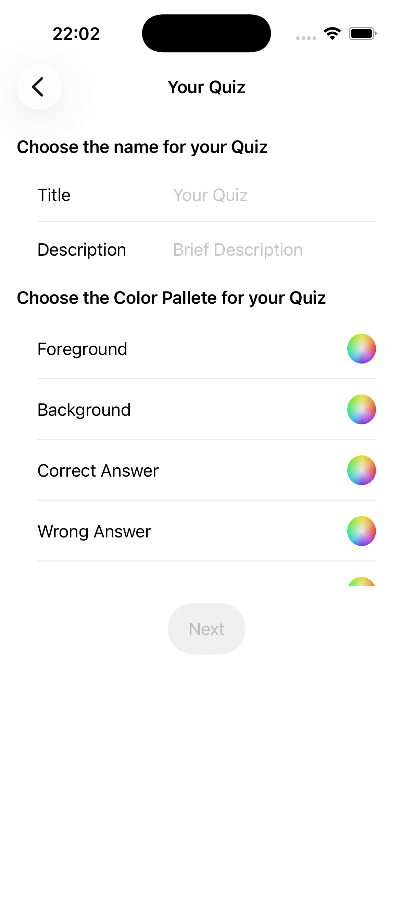
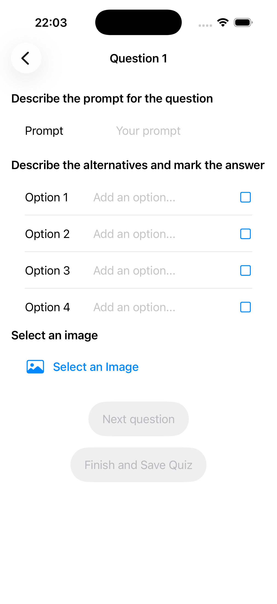
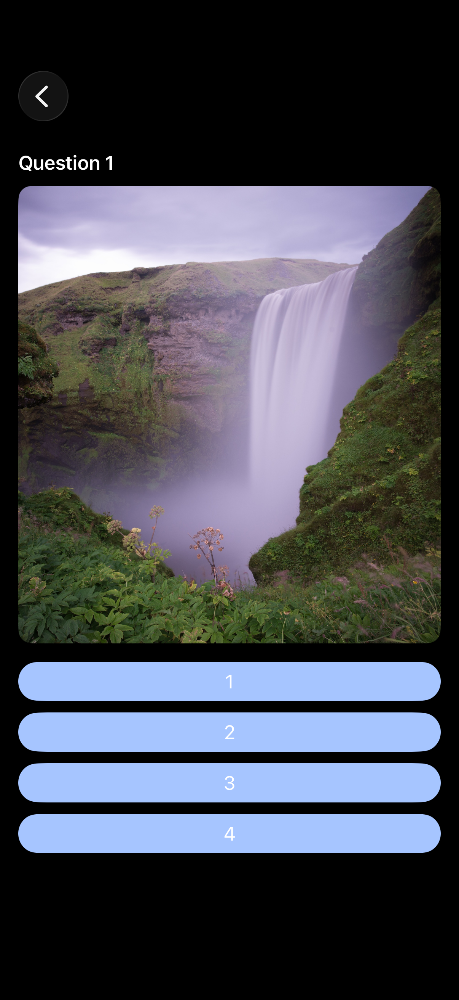
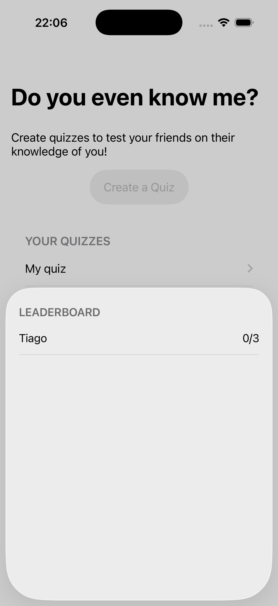

<h1 align="center">
    
</h1>

  <i align="center">Create a quiz about yourself and find out how well your <b>friends and family</b> really know you</i>

  
  
  
  

  

## Introduction

**Do you even know me?** is an **iOS app** built with UIKit that lets you build fully customized quizzes about yourself and challenge your friends and family to take them.

Define your own questions, add photos, pick a **custom color palette**, and see who scores highest on the leaderboard.

## Screenshots

Screenshots

 

    
&nbsp;
    

    
&nbsp;
    

    
&nbsp;
    

## Development

- **Architecture & Patterns**: MVC — each screen has a dedicated `UIViewController` paired with a programmatic `UIView`, keeping layout code out of controllers.
- **Frameworks**: UIKit for all UI; `UIColorWell` for the in-app color palette picker; `UISheetPresentationController` for the leaderboard bottom sheet; `PHPickerViewController` for photo selection.
- **Data persistence**: `QuizData` singleton encodes the quiz list as JSON to the Documents directory using `Codable`, with `.completeFileProtection` for on-device security.

## License

Do you even know me? is available under the [MIT License](./LICENSE).

The app is published on the [App Store](https://apps.apple.com/us/app/do-you-even-know-me/id6753122279).
